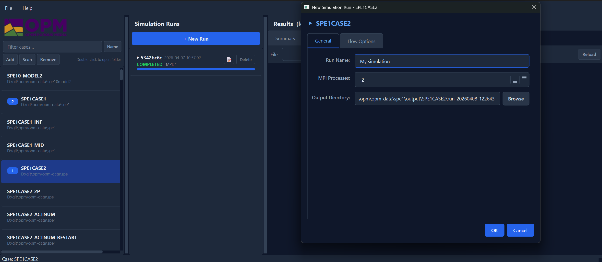
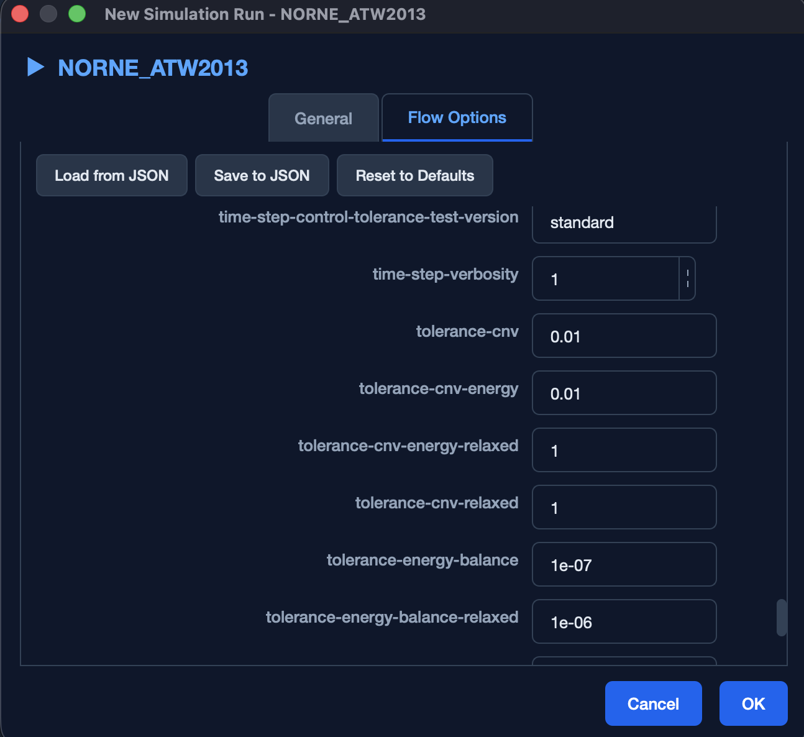
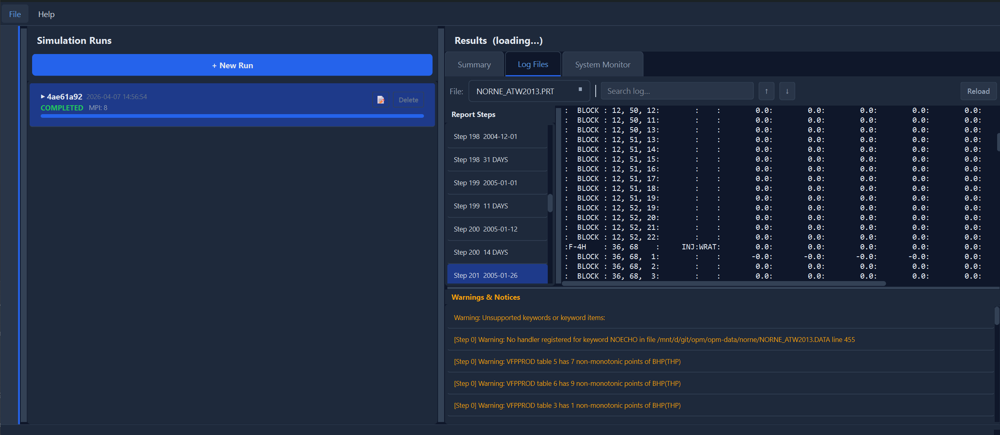
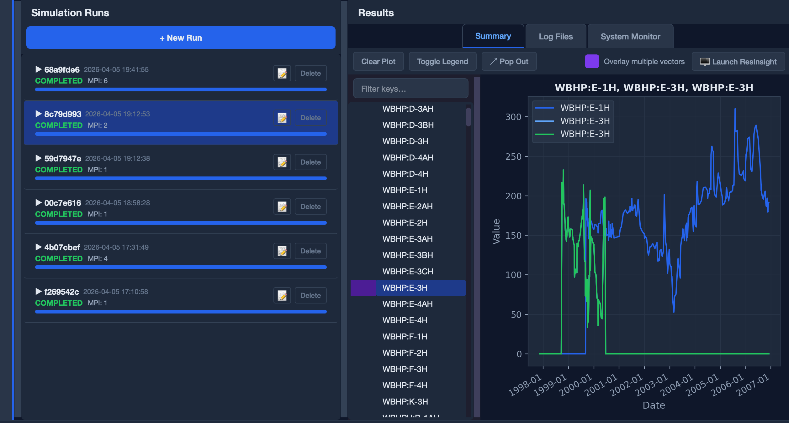

# OPM Flow GUI for managing and running simulations

This is a (mostly agent-coded) application for managing [OPM Flow](https://opm-project.org/) simulations.

## Features

- Scan specified folders for cases
- Manage output files in a single centralised directory and log cases that are run
- Automatically parse command line options and expose them in a GUI
- Parses simulation logs and highlight warnings and errors
- Reads and plots summary data using [resdata](https://github.com/equinor/resdata) for quick overviews of field, group and well responses.
- Launch [ResInsight](https://resinsight.org/) for deeper dives, including 3D visualization.
- Support for running WSL (GUI runs on Windows, launches cases on Linux process)

## Getting started

This is a standard Python project. If you use [uv](https://docs.astral.sh/uv/) it should be as simple as doing:

```bash
git clone https://github.com/SINTEF-agentlab/OPMFlowGUI.git
cd OPMFlowGUI
uv run opm_flow_gui/main.py
```

## Screenshots

### Naming and launching a simulation



### Setting command-line options



### Inspect the simulation log (DBG/PRT)



### Plot summary



### License

MIT license.

